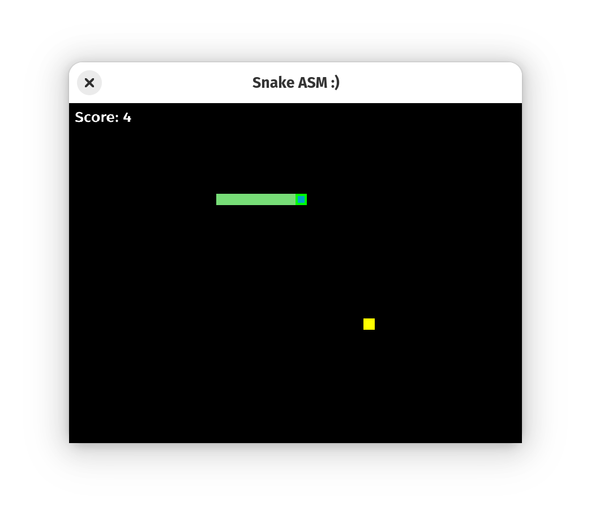

#### SNAKE ####

An Implementation of a snake game using x86_64 intel assembly for linux



### Requirements 
1. SDL 


#### ubuntu 
```sh
   $ sudo apt install libsdl2-dev libsdl2-ttf-dev
```
#### Fedora
```
   $ sudo dnf install SDL2-devel SDL2_ttf-devel
```


### Build
```
   $ make
```
### Run 
```
   $ ./snake
```
